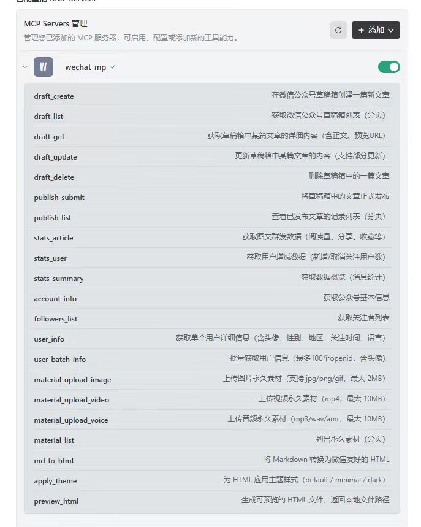

# leapgo-wechat-mcp

> 微信公众号 MCP 插件，通过 AI 自然语言操控公众号后台。支持草稿箱管理、群发发布、素材上传、Markdown 排版、数据统计等功能。兼容 Windows/Linux/macOS，配有 Hermes Agent 和 Trae IDE 接入指南。

---

## 📦 安装

### Step 1：解压

```bash
# Linux/macOS
tar -xzf leapgo-wechat-mcp-v0.2.tar.gz
cd leapgo-wechat-mcp

# Windows：使用解压缩工具解压到 D:\mcp\leapgo-wechat-mcp
```

### Step 2：创建虚拟环境并安装

**Windows（cmd）**
```cmd
cd D:\mcp\leapgo-wechat-mcp
python -m venv venv
venv\Scripts\activate
pip install -e .
```

**Windows（PowerShell）**
```powershell
cd D:\mcp\leapgo-wechat-mcp
python -m venv venv
.\venv\Scripts\Activate.ps1
pip install -e .
```
> ⚠️ 如果 PowerShell 提示「禁止运行脚本」，以管理员身份运行 `Set-ExecutionPolicy -ExecutionPolicy RemoteSigned -Scope CurrentUser`

**Linux/macOS**
```bash
tar -xzf wechat-mp-plugin-v0.2.tar.gz
cd wechat-mp-plugin
python -m venv venv
source venv/bin/activate
pip install -e .
```

### Step 3：配置 .env 文件

在项目根目录创建 `.env`：

```env
WECHAT_APP_ID=wxdd6181c2c086c7bf
WECHAT_APP_SECRET=cc2bb****58a12
```

> AppID 和 AppSecret 登录 [微信公众平台](https://mp.weixin.qq.com) → 设置与开发 → 基本配置 中获取

### Step 4：验证安装

```bash
# Linux/macOS
wechat-mp-server

# Windows
python -m wechat_mp.server
```

---

## 🛠 工具清单（共 21 个）

| 分类 | 工具 | 说明 |
|------|------|------|
| **草稿箱** | `draft_create` | 新建草稿 |
| | `draft_list` | 草稿列表（分页） |
| | `draft_get` | 草稿详情 |
| | `draft_update` | 更新草稿 |
| | `draft_delete` | 删除草稿 |
| **发布** | `publish_submit` | 发布草稿 |
| | `publish_list` | 发布记录列表 |
| **统计** | `stats_article` | 图文群发数据 |
| | `stats_user` | 用户增减数据 |
| | `stats_summary` | 数据概览 |
| **用户** | `followers_list` | 关注者列表 |
| | `user_info` | 单个用户详情（含头像/性别/地区） |
| | `user_batch_info` | 批量用户信息（最多100个） |
| **素材** | `material_upload_image` | 上传图片（最大2MB） |
| | `material_upload_video` | 上传视频（最大10MB） |
| | `material_upload_voice` | 上传音频（最大10MB） |
| | `material_list` | 素材列表（分页） |
| **Markdown** | `md_to_html` | Markdown → 微信友好 HTML |
| | `apply_theme` | 应用主题样式（default/minimal/dark） |
| | `preview_html` | 生成预览文件（跨平台） |

---

## 🤖 Hermes Agent 配置

已在 `/root/.hermes/config.yaml` 中配置，Server 重启后自动加载：

```yaml
mcp_servers:
  wechat_mp:
    command: /root/.hermes/venv/bin/wechat-mp-server
    env:
      WECHAT_APP_ID: wxdd6181c2c086c7bf
      WECHAT_APP_SECRET: cc2bb****58a12
```

> Hermes Agent 重启命令：`hermes restart`

---

## 💠 Trae IDE 配置（Windows / Linux）

Trae 基于 VS Code，通过 `settings.json` 配置 MCP Server。

### 找到配置文件

1. 打开 Trae → 设置（`Ctrl + ,`）
2. 搜索 `MCP`
3. 点击 **"Edit MCP Settings (JSON)"**

### 添加配置

**Windows 配置示例：**

```json
{
  "mcpServers": {
    "wechat_mp": {
      "command": "D:\\mcp\\leapgo-wechat-mcp\\venv\\Scripts\\python.exe",
      "args": [
        "-m",
        "wechat_mp.server"
      ],
      "env": {
        "WECHAT_APP_ID": "wxdd6181c2c086c7bf",
        "WECHAT_APP_SECRET": "cc2bb****58a12"
      }
    }
  }
}
```

**Linux/macOS 配置示例：**

```json
{
  "mcpServers": {
    "wechat_mp": {
      "command": "/path/to/venv/bin/wechat-mp-server",
      "env": {
        "WECHAT_APP_ID": "wxdd6181c2c086c7bf",
        "WECHAT_APP_SECRET": "cc2bb****58a12"
      }
    }
  }
}
```

### 验证

配置完成后，在 Trae 左侧 MCP 面板查看 `wechat_mp` 状态为 ✅ Connected 即成功。



---

## 📁 项目结构

```
leapgo-wechat-mcp/
├── README.md                    # 本文件
├── 使用手册.md                  # 详细使用手册
├── .env.example                # 配置示例
├── requirements.txt            # 依赖
├── pyproject.toml               # 项目配置
└── src/wechat_mp/
    ├── __init__.py
    ├── server.py                # MCP Server 入口（注册所有工具）
    ├── auth.py                  # access_token 管理（自动刷新）
    ├── config.py                # 配置（APP_ID / APP_SECRET）
    └── tools/
        ├── __init__.py         # 工具函数导出
        ├── draft.py            # 草稿箱 5 个工具
        ├── publish.py          # 发布 2 个工具
        ├── stats.py            # 统计 3 个工具
        ├── account.py          # 用户 3 个工具
        ├── material.py         # 素材 4 个工具
        └── md.py               # Markdown 3 个工具
```

---

## ⚠️ 已知限制

1. **`account_info` 查不到公众号头像** — 微信 API 不支持，请登录 mp.weixin.qq.com 后台查看
2. **视频无法以「视频卡片」形式插入草稿** — 必须手动在编辑器操作
3. **`thumb_media_id` 需要先上传图片获取** — 不能通过 URL 远程图片直接引用
4. **access_token 有效期 2 小时** — 已实现自动刷新，无需手动处理

---

## 🔧 常见问题

**Q: 报 `40001 access_token is invalid`？**
> 检查 `.env` 中 `WECHAT_APP_ID` 和 `WECHAT_APP_SECRET` 是否正确。

**Q: Trae 里 MCP 状态一直是 ❌ Error？**
> 确认 `command` 填的是 Python 路径（如 `D:\...\python.exe`），不是 `node`

**Q: 提示 `command not found` 或文件找不到？**
> - **Windows**：检查 `venv\Scripts\python.exe` 或 `venv\Scripts\wechat-mp-server.exe` 是否存在
> - **Linux**：检查 `/root/.hermes/venv/bin/wechat-mp-server` 是否存在

**Q: 上传图片报 `40005`？**
> 图片大小超过 2MB，或格式不支持。使用 jpg/png/gif，控制在 2MB 以内。

**Q: 发布失败报 `44002`？**
> 草稿正文内容为空，先确保 `content` 参数有内容。

---

## 📄 许可证

MIT License · 西安跃行信息科技有限公司 LeapGo
